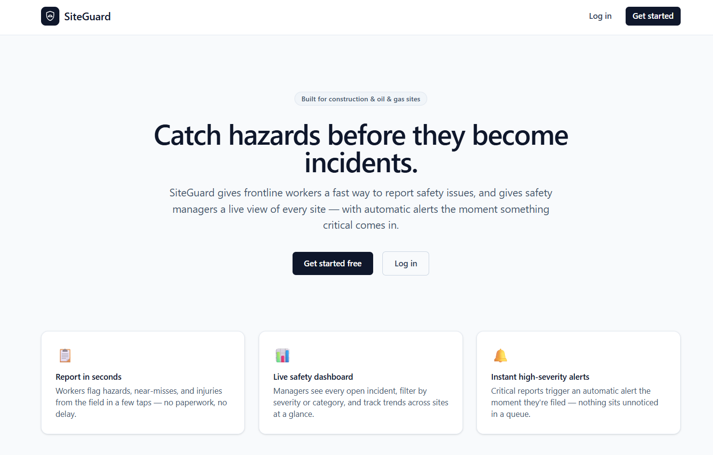
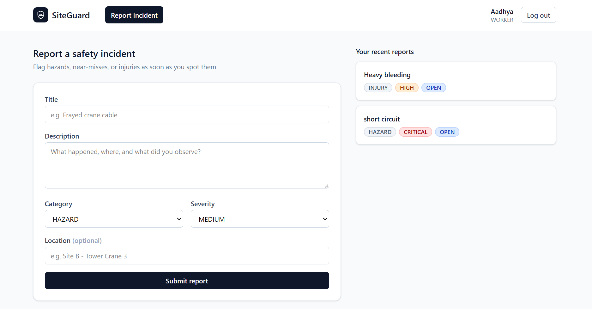
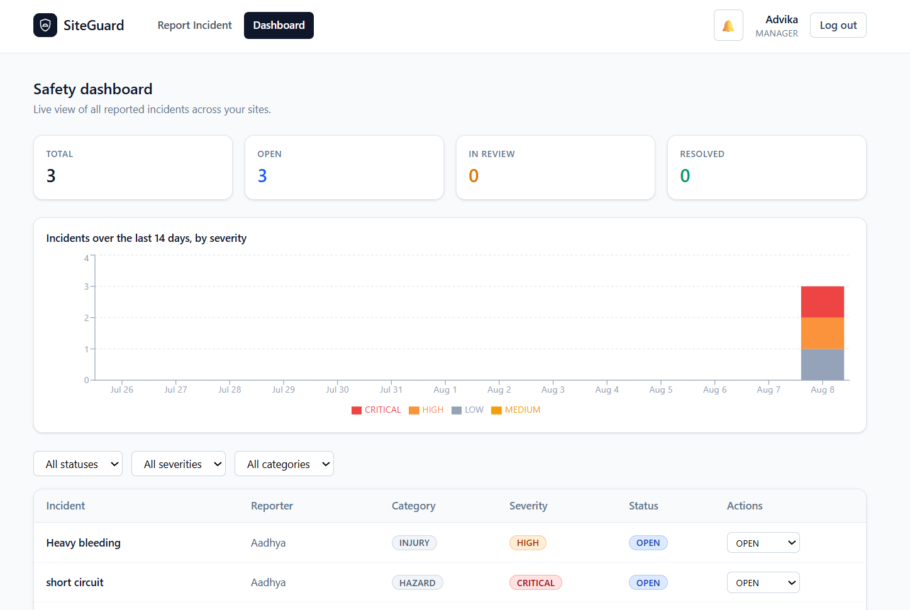

# SiteGuard — Site Incident & Safety Reporting Platform

A full-stack safety incident reporting system for high-risk work sites (construction, oil & gas). Frontline workers report hazards, near-misses, and injuries; safety managers triage and track them on a live dashboard, with automatic alerts on high-severity reports.

## Live demo

**[safety-incident-platform.vercel.app](https://safety-incident-platform.vercel.app/)**

Frontend (Vercel) and API/database (Render) are both fully live — sign up as a Worker or a Safety Manager and try the whole flow yourself.


## Screenshots

**Landing page**


**Worker — reporting an incident**


**Manager — live dashboard**


## Demo video — alerting in action

<!

https://github.com/user-attachments/assets/8ffb2fc6-b166-4a3f-bdf0-cb6ac885b3e9


## Architecture

Three independently deployable services, containerized and orchestrated with Docker Compose:

```
┌──────────┐      ┌─────────────┐      ┌──────────────┐
│  React   │ ───▶ │  Express    │ ───▶ │  PostgreSQL  │
│ frontend │      │  API        │      │              │
│ (nginx)  │ ◀─── │             │ ◀─── │              │
└──────────┘      └──────┬──────┘      └──────────────┘
                          │ publishes
                          │ incident.created
                          ▼
                   ┌─────────────┐      ┌──────────────┐
                   │    Redis    │ ───▶ │   Worker     │
                   │  (BullMQ)   │      │  service     │
                   └─────────────┘      └──────┬───────┘
                                                │ writes alert
                                                ▼
                                          PostgreSQL
```

The API and worker are separate services with independent deploy lifecycles, communicating asynchronously over a Redis-backed queue — not a shared in-process function call. The worker decides notification policy (which severities trigger an alert) independently of the API.

## Tech stack

| Layer | Technology |
|---|---|
| Frontend | React (Vite), React Router, Tailwind CSS, Recharts |
| API | Node.js, Express, Prisma, JWT auth, Zod validation |
| Worker | Node.js, BullMQ, Prisma |
| Database | PostgreSQL |
| Queue | Redis (BullMQ) |
| Containerization | Docker, Docker Compose (multi-stage builds, nginx for static serving) |
| Deployment | Vercel (frontend), Render (API, Postgres, Redis) |
| CI | GitHub Actions — lints/builds each service, then a full docker-compose integration smoke test |

## Features

- JWT authentication with two roles: **Worker** (reports incidents) and **Safety Manager** (triages, updates status, sees analytics)
- Incident reporting: category, severity, location, description
- Manager dashboard: live stats, a 14-day incident timeline stacked by severity, filterable incident table, inline status updates
- Async alerting: high/critical-severity incidents automatically generate a notification via the worker service, surfaced as a live-polling alerts bell in the UI
- Role-based access control enforced server-side (not just hidden in the UI)

## Performance

Load tested with [k6](https://k6.io) at 50 concurrent users (`load-test/incident-load-test.js`). The first run failed its own latency threshold — 0% errors, but p95 latency of 2.47s, caused by an unpaginated list endpoint returning the entire (and growing) incidents table on every request. Fixed with server-side pagination + indexes:

| Metric | Before | After |
|---|---|---|
| p95 latency | 2.47s | **15.47ms** |
| Throughput | 25.7 req/s | 51.5 req/s |
| Data transferred | 267 MB | 53 MB |

Full writeup: [`load-test/README.md`](load-test/README.md).

## Running locally

Requires Docker Desktop.

```bash
docker compose up --build
```

This brings up Postgres, Redis, the API, the worker, and the frontend. Migrations run automatically on API/worker startup.

- Frontend: http://localhost:8080

Sign up as either a Worker or a Safety Manager from the app's signup screen. This is the only way to see the full pipeline end to end, including the worker consuming queue events and generating live alerts.

## Project structure

```
apps/
  api/      Express REST API (auth, incidents, notifications)
  worker/   Standalone service consuming incident events off Redis
  web/      React frontend
docker-compose.yml
render.yaml   Render Blueprint (Postgres + Redis + API)
```
